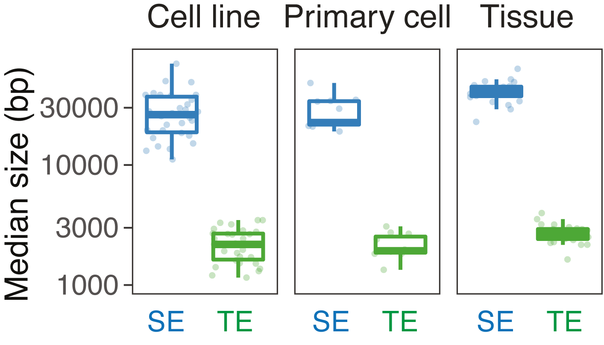
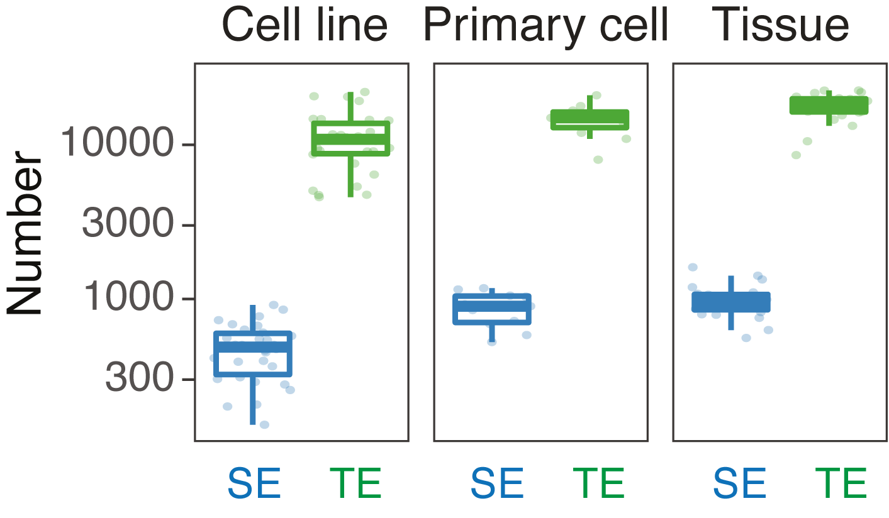

# A core collection of super-enhancers with their unique charactheristics 

## Introduction
This repertoire contains a set of super-enhancers along with typical enhancers and stretch enhancers on selected cell-lines / tissues. In addition, a series of statistical comparisons were carried out between super-enhancers and typical/stretch enhancers. These analyses demonstrate that super-enhancers are a unique subclass of enhancers, with distinct characteristics from typical enhancers and, more importantly, stretch enhancers.  

## Data access
#### Super-enhancers and typical enhancers identified based on ChIP-seq data from the ENCODE project  
We collected the data and provide downloadings below: 
1. Super-enhancers [[SE Download]](files/)  
2. Typical enhancers [[TE Download]](files/)   
    
**Note**: Above are links for bulk downloadings, please check [here](html/test.html) for an additional table to download the data of individual cell types.     

#### Super-enhancers, stretch enhancers, and typical enhancers in the ten extensively studies cell lines  
We collected the data and provide downloadings below: 
1. Super-enhancers [[SE Download]](files/)  
2. Stretch enhancers [[StrE Download]](files/)   
3. Typical enhancers [[TE Download]](files/)   
     
**Note**: Above are links for bulk downloadings, please check [here](html/test.html) for an additional table to download the data of individual cell types.   
  
## Comparison to typical enhancers  
We compared the size and the number of SEs and typical enhancers (TE) in each cell type.  

#### SE vs TE: median size   

  

#### SE vs TE: numbers    

  

Please click [here](html/test.html) to recap the analysis.   
  
## Comparison to stretch enhancers   
We compared the size and the number of SEs, stretch enhancers (StrE) and typical enhancers (TE) in each cell type.  

#### SE vs StrE vs TE: median size   

  

#### SE vs StrE vs TE: numbers    

  

Please click [here](html/test.html) to recap the analysis.   

## Super-enhancer landscape, hierarchical clustering, and principle component analysis  
#### Landscape on chromosomes  

  

#### Hierarchical clustering  
Hierarchical clustering based on SE cooccurrence Jaccard distance between paris of samples  

  

#### Principal component analysis  
Principal component analysis based on SE occurrence matrix on all the samples  

  

Please click [here](html/test.html) to recap the analysis.   
  
### Support or Contact
Xi Wang (xi.wang at dkfz dot de)

### Citation 
_in preparation_

